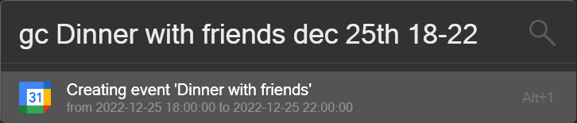

# Google Calendar Plugin for Flow Launcher
A plugin for Flow Launcher to add events to Google Calendar. To use the plugin, you need to create a Google Cloud Platform project, enable the Google Calendar API, and create credentials. The plugin will use the credentials to access your Google Calendar. Your credentials are stored locally on your computer and are not sent to any server.

# Setup
Instructions for setting up your Google Cloud credentials, you can also follow the instructions [here](https://developers.google.com/calendar/api/quickstart/python) up until 'Install the Google client library' step. It is not necessary to enter payment information for your Google Cloud account.
1. [Create a Google Cloud project](https://developers.google.com/workspace/guides/create-project)
2. [Enable the Google Calendar API](https://console.cloud.google.com/flows/enableapi?apiid=calendar-json.googleapis.com)
3. In the Google Cloud console, go to Menu > **APIs & Services** > **Credentials**
4. Click **Create credentials** > **OAuth client ID**
5. You will be prompted to set up a OAuth consent screen. Select **External** and click **Create**
6. Click **ADD OR REMOVE SCOPES** and add the following scope: `https://www.googleapis.com/auth/calendar`
7. Add the email address you want to use to the list of test users
8. Go back to the Credentials page and click **Create credentials** > **OAuth client ID**
9. Select **Desktop app** and click **Create**
10. In the **Name** field, enter a name for your credentials, this can be anything
11. Click **Create**
12. Click **Download JSON** and save the file as `credentials.json`
13. Open the FlowLauncher folder by typing 'userdata' in the Flow Launcher search bar
14. Navigate to **Plugins** > **Flow.Launcher.Plugin.GoogleCalendar-[version_number]**
15. Copy the `credentials.json` file into this folder

After typing your first event in the Flow Launcher search bar, a Google sign in window will appear. Sign in with the Google account you want to add events to and allow access to your calendar. You will only need to do this once.
Flow Launcher might throw an error, this is a known bug, just close the error window and the plugin will work as expected.

# Usage
Type 'gc' in the Flow Launcher search bar and first enter the event name, then the event date and time. The date and time can be entered in any format, but check if the shown dates and times are correct. Examples include:
- gc Dinner with friends 2021-12-25 19:00-20:00
- gc Dinner with friends tomorrow 19-20
- gc Dinner with friends next friday from 7pm to 8pm

# Acknowledgements
This plugin uses the ctparse library to support natural language date and time parsing. The library can be found [here](https://github.com/comtravo/ctparse)
